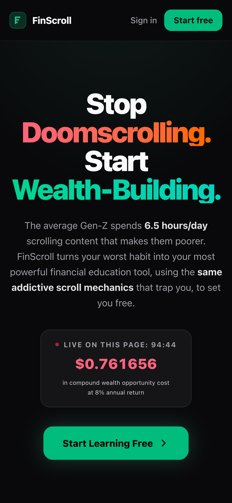
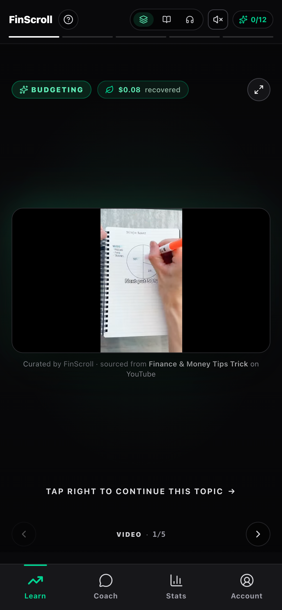
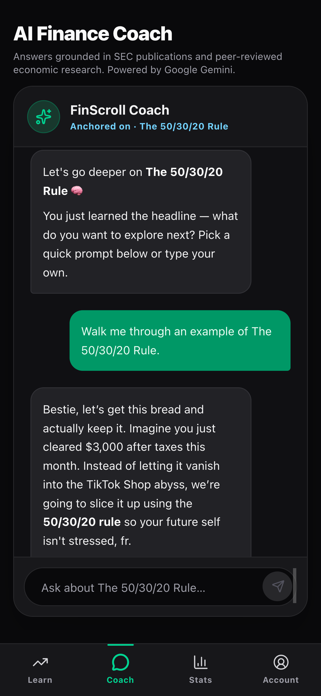
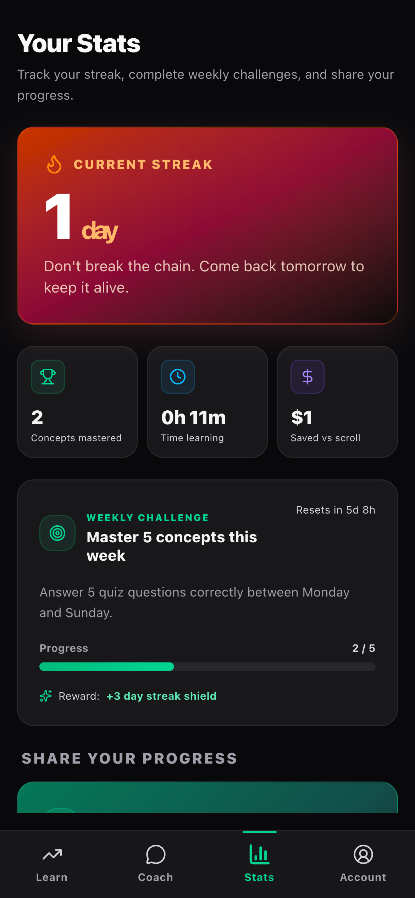
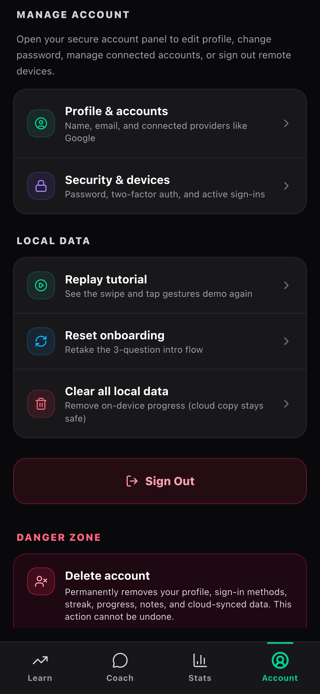

# FinScroll

> **Stop Doomscrolling. Start Wealth-Building.**

A financial literacy app for younger users worldwide that hijacks the doomscrolling habit and turns it into compound-interest education. Every fact grounded in SEC publications and peer-reviewed economic research.

**Live demo:** https://fin-scroll.vercel.app

---

## Demo

https://github.com/user-attachments/assets/cbc39634-c74f-49bc-954c-fb2c3ce140fc

---

## The problem

Younger generations worldwide spend **~6 hours/day** scrolling content that makes them poorer:

- Financial advice comes from short-form-video influencers pushing meme stocks, leveraged crypto, and day-trading schemes
- **95% of day traders lose money** (U.S. SEC retail-investor data; same pattern in UK FCA, Australian ASIC, EU ESMA reports)
- The 6 hours themselves carry a measurable opportunity cost — money never invested, never compounded

The problem is global, not US-specific. TikTok and Reels have over a billion monthly active users; the same finfluencer-driven misinformation appears in essentially every market with mass-market smartphone penetration.

No mainstream product directly connects the doomscrolling habit to its real financial cost AND teaches alternatives in the same scroll-snap format younger users actually engage with.

---

## The solution

FinScroll intercepts the habit loop. Same addictive vertical scroll mechanics that trap users — but every card teaches a real, sourced financial concept, with a quick knowledge check that builds streaks and unlocks compound learning.

| Surface | What it does |
|---|---|
| **Learn (FinScroll Feed)** | 5-frame story cards: Video → Visual → Insight → Quiz → Proof. 33+ cards (12 hand-curated + daily RAG drop + 20 pre-generated pool), inline YouTube embeds, source citations |
| **Roast Mode** | 24-myth library across 5 categories with severity ratings; AI roasts user-submitted finfluencer claims with grounded citations |
| **Coach** | RAG chatbot grounded in Pinecone vector search + curated academic references. "Ask Coach about this concept" deep-links from any Learn card |
| **Stats** | Streak hero, concepts-mastered counter, weekly log, shareable streak card (PNG via `html-to-image`, Web Share API) |

---

## Architecture

```
                ┌─────────────────────────────┐
                │   Next.js 16 App Router     │
                │   (Vercel, edge runtime)    │
                └─────────────────────────────┘
                              │
        ┌─────────────────────┼─────────────────────┐
        │                     │                     │
        ▼                     ▼                     ▼
  ┌──────────┐         ┌──────────────┐      ┌──────────────┐
  │   Clerk  │         │   Upstash    │      │   Supabase   │
  │   auth   │         │    Redis     │      │   Postgres   │
  └──────────┘         │              │      │              │
                       │  L1 cache    │      │  L2 cache    │
                       │  rate-limit  │      │  user state  │
                       └──────────────┘      └──────────────┘
                              │                     │
                              └─────────┬───────────┘
                                        ▼
                              ┌───────────────────┐
                              │   Card generator  │
                              │  ┌─────────────┐  │
                              │  │ 3-tier      │  │
                              │  │ Gemini      │  │
                              │  │ fallback    │  │
                              │  │ ladder      │  │
                              │  └─────────────┘  │
                              └─────────┬─────────┘
                                        ▼
                               ┌───────────────┐
                               │   Pinecone    │
                               │ (SEC + acad.) │
                               └───────────────┘
```

### Three engineering decisions worth talking about

**1. Three-tier LLM fallback ladder** (`src/lib/geminiFallback.ts`)

Every Gemini call cycles through `gemini-3-flash-preview → gemini-2.5-flash-lite → gemini-2.0-flash` on `429`/`5xx` errors. Combined with a parse-failure retry in `cardGenerator.ts`, this turns three preview-model quotas (~25 RPD each) into a combined ~2,600 RPD ceiling. During the offline pool generation, we hit the wall on 12/20 cards on the primary model — fallback recovered all 12 without any user-visible failures.

**2. Two-layer card cache (Redis → Supabase → LLM)**

L1 = Upstash Redis (~2 ms hit), L2 = Supabase Postgres (~50 ms hit), L3 = Gemini API (~3 s cold gen). The card generator transparently falls down the levels on miss and warms each layer on the way back up. Same flow used by `/api/cards/generate`, `/api/cards/daily`, and the daily cron — all benefit from shared cache state across Vercel serverless instances.

**3. Static + dynamic + on-demand content stream**

```
12 hand-curated cards (cards.ts)
+ 1 daily RAG-generated card (rotates by day-of-year mod seed count)
+ 20 offline pre-generated cards (cards-pool.json, ships with build)
+ on-demand generation via /api/cards/generate when user nears the end
+ daily Vercel cron writing 2 new cards to Supabase per day
= "infinite" feed that costs ~$0 at portfolio scale
```

All four sources flow through the same Card schema and render through the same Story 5-frame component.

---

## Tech stack

| Layer | Stack |
|---|---|
| Framework | Next.js 16 (App Router, Turbopack) |
| Language | TypeScript 5 (strict) |
| Styling | Tailwind CSS 4 |
| Auth | Clerk |
| LLM | Google Gemini (3-flash-preview / 2.5-flash-lite / 2.0-flash fallback ladder) |
| Vector DB | Pinecone (3072-dim embeddings) |
| RAG orchestration | LangChain Core |
| User DB | Supabase Postgres |
| Cache + rate limiter | Upstash Redis |
| Email (contact form) | Resend |
| Error monitoring | Sentry |
| Validation | Zod (`.strict()` everywhere) |
| PWA | Custom service worker + Web App Manifest |

---

## Live engineering surfaces

### Security

- **Clerk middleware** protects every app route + write API; returns JSON 401, not HTML redirects, so client-side fetches handle auth failures cleanly
- **Strict CORS** — origin pinned to `ALLOWED_ORIGINS` env var (not wildcard) when credentials enabled
- **Security headers** on every response — X-Frame-Options, X-Content-Type-Options, Referrer-Policy, Permissions-Policy, HSTS
- **Rate limiting** — Upstash-backed atomic counters survive cold starts and are shared across serverless instances. In-memory `Map` fallback preserves the same API when Redis isn't configured
- **Prompt-injection sanitization** before any user text reaches an LLM prompt
- **Zod validation** on every API body + every LLM response (cards never render unless they pass the strict schema)
- **Email-header injection guard** on the contact form (strip CR/LF + content scoring for spam)
- **Type-to-confirm DELETE** on the account-deletion flow

### Resilience

- **Three-tier Gemini fallback** + parse-failure retry — see above
- **Graceful degradation everywhere** — every external service has an in-process fallback:
  - Redis missing → in-memory Map
  - Supabase missing → localStorage-only mode
  - Resend missing → log + acknowledge (dev fallback)
  - Sentry missing → no-op
- **Fail-open rate limiter** — if Redis errors mid-request, requests pass through with a warning log rather than locking out legitimate users
- **`window.location.replace` on account deletion** — bypasses any stuck Clerk auth context during the post-delete state transition
- **Service-worker v3** — versioned cache invalidates on bumps

### Observability

- Sentry captures every API failure with route + operation tags
- Structured server logs for cache hits/misses, fallback model usage, rate-limit decisions
- Each card response includes a `cached: boolean` flag so the client can tune prefetch aggressiveness

---

## Screenshots

> _Drop screenshots into `docs/screenshots/` and they'll render here. See [docs/screenshots/README.md](docs/screenshots/README.md) for the capture checklist._

| Landing | Learn feed | AI Coach |
|---|---|---|
|  |  |  |

| Stats | Account | Receipt share |
|---|---|---|
|  |  |  |

---

## Quick start

### Prerequisites

- Node.js 20+
- Accounts at: [Clerk](https://clerk.com) (auth), [Pinecone](https://pinecone.io) (vector DB), [Google AI Studio](https://aistudio.google.com) (Gemini)
- Optional: [Supabase](https://supabase.com) (cross-device sync), [Upstash](https://upstash.com) (Redis), [Resend](https://resend.com) (contact form email), [Sentry](https://sentry.io) (errors)

### Setup

```bash
# 1. Install dependencies
npm install

# 2. Create .env.local with the required keys
cat > .env.local <<'EOF'
# Required
PINECONE_API_KEY=
PINECONE_INDEX=scrollwise-index
GOOGLE_GEMINI_API_KEY=
NEXT_PUBLIC_CLERK_PUBLISHABLE_KEY=
CLERK_SECRET_KEY=

# Cross-device sync (optional)
SUPABASE_URL=
SUPABASE_SERVICE_ROLE_KEY=

# Distributed rate limiting + L1 card cache (optional)
UPSTASH_REDIS_REST_URL=
UPSTASH_REDIS_REST_TOKEN=

# Daily card-generation cron (optional)
CRON_SECRET=

# Contact form (optional)
RESEND_API_KEY=
CONTACT_TO_EMAIL=

# CORS / Clerk allowed origin
ALLOWED_ORIGINS=http://localhost:3000
EOF

# 3. (Optional) Pre-generate the static card pool — once, runs locally
npm run generate:cards

# 4. (Optional) Run the Supabase schema in your Supabase SQL editor
#    See supabase/schema.sql

# 5. Start the dev server
npm run dev
```

Open `http://localhost:3000`.

### Useful scripts

| Command | What it does |
|---|---|
| `npm run dev` | Local dev server with Turbopack |
| `npm run build` / `npm run start` | Production build + serve |
| `npm run lint` | ESLint (Next.js config) |
| `npm run generate:cards [-- --max N --level Beginner --force]` | Offline pre-generation of pool cards via RAG. Resume-safe — skip already-generated seeds |
| `npm run attach:videos` | Merge curated `videoEmbedUrl`s from `conceptSeeds.ts` into existing pool cards (zero LLM calls) |
| `npm run test:redis` | Functional test for the Upstash rate-limit + cache integration. Skips gracefully if Upstash isn't configured |

---

## Project structure

```
src/
├── app/
│   ├── (app)/                Protected routes (Clerk-gated)
│   │   ├── feed/             FinScroll Learn feed
│   │   ├── roast/            Finfluencer Roast Mode
│   │   ├── chat/             AI Coach (RAG chat)
│   │   ├── stats/            Streak / share
│   │   └── account/          Profile + delete-account flow
│   ├── (legal)/              Public Privacy / Terms / Contact pages
│   ├── api/
│   │   ├── chat/             RAG-grounded chat endpoint
│   │   ├── cards/
│   │   │   ├── daily/        Today's auto-generated card
│   │   │   └── generate/     On-demand card generation (infinite scroll)
│   │   ├── contact/          Resend-backed contact form handler
│   │   ├── cron/             Vercel cron handlers (daily card generation)
│   │   ├── search/           Pinecone semantic search
│   │   ├── me/state/         Cross-device user-state sync
│   │   ├── ingest/           Raw-text ingestion pipeline
│   │   ├── ingest-url/       URL scrape + ingestion
│   │   └── preload/          SEC + Springer seed pipeline
│   ├── sign-in / sign-up/    Clerk auth pages
│   ├── not-found.tsx         Branded 404
│   ├── layout.tsx            Root layout + Clerk provider
│   └── page.tsx              Landing
├── components/               React components (FinScrollFeed, ChatInterface, etc.)
│   ├── brand/                FinScroll mark (single source of truth)
│   └── learn/                Story-card 5-frame components
├── lib/                      Pure utilities
│   ├── geminiFallback.ts     3-tier model fallback ladder
│   ├── rateLimit.ts          Upstash + in-memory rate limiter
│   ├── academicReferences.ts Curated peer-reviewed citations
│   ├── learn/
│   │   ├── impact.ts         Compound-wealth impact engine
│   │   ├── useInfiniteCards  Prefetch hook for /api/cards/generate
│   │   ├── cards.ts          12 hand-curated cards
│   │   └── cards-pool.json   20 pre-generated pool cards
│   └── ...
├── services/                 Business logic
│   ├── cardGenerator.ts      RAG card generator + dual cache
│   ├── chat.ts               Chat with card-anchored context
│   └── ...
├── proxy.ts                  Clerk middleware (Next.js 16 convention)

scripts/
├── generate-cards.ts         Offline pre-generation CLI
├── attach-videos.ts          Video URL merge (no LLM)
└── test-redis.ts             Upstash functional test

supabase/schema.sql           User state + generated_cards table DDL
public/                       Manifest, service worker, icons, OG image
vercel.json                   Daily cron schedule
```

---

## Trade-offs and honest limits

A few things worth knowing if you're reading the code:

- **Clerk development keys** are used for the live deploy (no real users yet). Lighthouse Performance scores ~70 because of the dev-mode handshake redirect chain (~1.7 s on every page). Production keys require a custom domain.
- **Daily Gemini free-tier quota** caps card regeneration at ~25-1,500 RPD depending on model. The 3-tier fallback ladder pushes the effective ceiling to ~2,600 RPD, but a true production workload would need a paid Gemini plan.
- **No real-time scaling tests** — the rate limiter, cache, and serverless functions all handle portfolio-scale traffic comfortably, but I haven't load-tested at thousands of concurrent users.
- **Three pool cards (hsa-triple-tax done, concentrated-positions, beta-hedging)** don't have curated YouTube embeds yet. The two remaining fall through to a "Find a related video" CTA that opens YouTube search.

---

## License

Educational and portfolio-demonstration use only. Not financial advice. Always consult a licensed financial advisor before making real money decisions.
